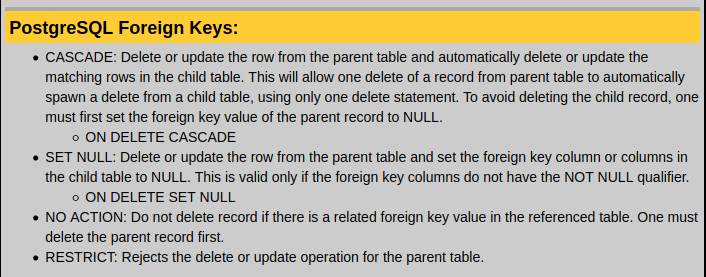

Primeiro de todo: Qué é DDL? 
DDL son as iniciais de "Data Definition Language". Esto é bastante autoexplicativo.  É unha sublinguaxe SQL que nos permite definir a  estructura dos datos cós que logo imos traballar.  Neste texto cubriremos os seus comandos principais CREATE, ALTER e DROP.  

## CREATE
O primeiro sirvenos pra crear ([Schemas](https://www.postgresql.org/docs/9.2/ddl-schemas.html#DDL-SCHEMAS-CREATE), [taboas](https://www.postgresql.org/docs/9.2/sql-createtable.html)...), da seguinte maneira: 
~~~~sql
CREATE SCHEMA myDB;
~~~~
No caso de querer crear unha táboa fariamos:
~~~~sql
CREATE TABLE nomeTaboa(
	nomeCampo tipoCampo
	[,nomeCampoN tipoCampoN]
	[,CONSTRAINT nomeClavePrimaria PRIMARY KEY (campoN [,campoM])]
	[,CONSTRAINT nomeClaveForanea FOREIGN KEY (campoN [,campoM])
		REFERENCES taboaDeReferencia (campoN [,campoM])
		ON UPDATE (NA | SET NULL | SET DEFAULT | CASCADE)
		ON DELETE (NA | CASCADE | SET NULL | SET DEFAULT)]
	[,CHECK (PREDICADE)] 
--Queda pendiente el on update on delete
);
~~~~
Este sería un exemplo da estructura dun "Create table";

Como exemplo "real" teríamos este:
~~~~sql
CREATE TABLE Visita(
  Codigo_Tripulacion CodigoValido,
  Codigo_Planeta CodigoValido,
  Data_Visita DATE,
  Tempo varchar(30),
  PRIMARY KEY(Codigo_Tripulacion, Codigo_Planeta, Data_Visita),
  CONSTRAINT FK_Visita_Tripulacion
    FOREIGN KEY(Codigo_Tripulacion)
    REFERENCES "NavesEspaciais".Tripulacion(Codigo_Tripulacion)
    ON UPDATE CASCADE
    ON DELETE CASCADE,
  CONSTRAINT FK_Visita_Planeta
    FOREIGN KEY(Codigo_Planeta)
    REFERENCES "NavesEspaciais".Planeta(Codigo_Planeta)
    ON UPDATE CASCADE
    ON DELETE CASCADE
);
~~~~
Aqui podemos ver como temos unha táboa "Visita" cunha chave principal composta e que ademais ten duas 
chaves foráneas, neste caso simples. 
Vemos que ambas chaves utilizan o valor "Cascade" tanto pra ON UPDATE como pra ON DELETE (Ver mais sobre o contraint [FOREIGN KEY](https://www.postgresql.org/docs/9.5/ddl-constraints.html#DDL-CONSTRAINTS-FK)). Este será o valor que terá no 90% dos casos reais. 

^ Créditos da imaxe a http://www.yolinux.com ^ 

Poñendo un exemplo de táboa onde se utilize o [CHECK](https://www.postgresql.org/docs/9.5/ddl-constraints.html#DDL-CONSTRAINTS-CHECK-CONSTRAINTS), podemos facer algo como:
~~~~sql
CREATE TABLE Produto(
	idProducto bigInt PRIMARY KEY,
	precio numeric NOT NULL DEFAULT 1.00,
	CHECK precio > 0
);
~~~~
[Voltar ó comezo](#comezo)

#### CONSTRAINTS
Como podemos ver, tamen podemos utilizar certos [constraints](https://www.postgresql.org/docs/9.2/ddl-constraints.html) (primary key, foreign key, not null, unique...) xusto despois de definir o tipo de datos. Mais deberiamos ter en conta que esto solo se pode facer no caso de que sexa chaves simples e non compostas. Polo tanto, podemos afirmar que a "boa praxe" sería engadindo constraints despois de definir os datos, por funcioa en todos os casos.
A instruccion [DEFAULT](https://www.postgresql.org/docs/9.2/ddl-default.html) permítenos definir que valor terá por defecto o valor de esa columna en cada nova tupla creada

## DROP
Agora vamos a revisar a instrucción DROP:
Esta instrucción pode ser aplicada tanto pra eliminar schemas e tablas, como pra eliminar columnas dunha tábia, dentro dun alter table, como veremos mais adiante. A continuacion vemos alguns exemplos:

~~~~sql
DROP [SCHEMA | DATABASE] [IF EXISTS] <nome-da-bd>;
~~~~ 
O "IF EXISTS" é bastante recomendábel, evita que borres o que non queres borrar

~~~~sql
DROP TABLE [IF EXISTS] <nome-da-taboa> [ CASCADE | RESTRICT ];
--Cascade: Elimina as táboas cás que está relacionada
--Restrict: Non podes borrar a táboa se ten algunha relación con outra táboa 
~~~~
Esto permitiríanos eliminar unha táboa, seleccionando en qué modo a eliminamos.

[Voltar ó comezo](#comezo)

## ALTER 
Esta instruccion permitenos operar a nivel columna (ADD ou DROP) e a nivel constraint (ADD ou DROP)

Existe o caso no que, pra certos esquemas, non podemos referenciar unha chave axena a outra táboa xa que esa outra táboa inda non existe. Nese caso, necesitaremos engadir o constraint mais tarde, utilizando pra iso ALTER TABLE (add constraint).
Un exemplo seria:
~~~~sql
ALTER TABLE Visita(
	ADD CONSTRAINT FK_Visita_Planeta
	FOREIGN KEY(Codigo_Planeta)
		REFERENCES "NavesEspaciais".Planeta(Codigo_Planeta)
		ON UPDATE CASCADE
		ON DELETE CASCADE
);
~~~~
Este exemplo permitiríanos engadir a mesma FK que previamente engadimos na consulta CREATE TABLE, pero a posteriori. 

Tamén podemos utilizar o comando ALTER pra alterar columnas.

~~~~sql
ALTER TABLE Visita
	ALTER COLUMN Data_Visita 
	TYPE varchar(30);
~~~~
Tamén podemos utilizar DROP dentro dunha consulta ALTER, da seguinte maneira
~~~~sql
ALTER TABLE <nome-da-táboa>
	DROP COLUMN <nome-da-columna>;
--Checkear esta consulta
~~~~

As posibilidades de ALTER son demasiadas como pra cubrilas nun resumo de este estilo. Para ver todo o que se pode facer con este comando o recomendábel é consultar a [documentación](https://www.postgresql.org/docs/9.1/sql-altertable.html).

Fontes:
	- [yolinux.com](http://www.yolinux.com/TUTORIALS/PostgreSQL-Transactions-ForeignKeys.html)
	- [Documentacion oficial de PostgreSQL](https://www.postgresql.org/docs/9.5/ddl.html)
	
[Voltar ó comezo](#comezo)

