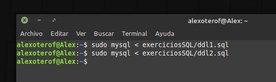
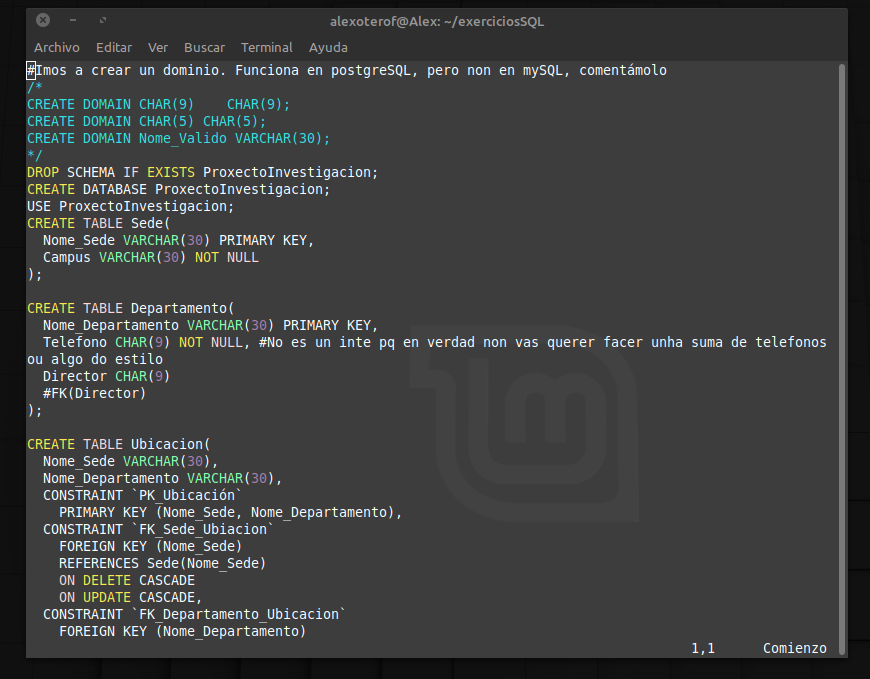

# Proxectos de investigación.
Ímos aportar unha solución aos exercicios propostos [aqui](https://github.com/davidgchaves/first-steps-with-git-and-github-wirtz-asir1-and-dam1/tree/master/exercicios-ddl/1-proxectos-de-investigacion) e [aquí](https://github.com/davidgchaves/first-steps-with-git-and-github-wirtz-asir1-and-dam1/tree/master/exercicios-ddl/2-naves-espaciais). Pra eso vamos usar os scripts sql que se atopan nesta carpeta. 
Poderiamos logearnos na base de datos e despois facer as consultas ddl unha a unha, pero pareceume máis cómoda esta maneira de facelo. 
Pra executalos, unha vez temos instalado e funcionando mariadb (Recordemos que o podemos comprobar con sudo systemctl status mariadb) imos a facer:
````
sudo mysql < rutaENomeDoArquivo.sql
````


Si todo vai ben e non temos erros no script, non nos dará ningunha saída de confirmación. En caso de haber algún problema cá sintaxe especificaranos a liña aproximada onde se atopa o erro. 
No noso caso, por exemplo, tivemos que comentar algunhas partes e cambiar outras respectoo a solución atopada previamente en clase por diferencias entre a sintaxe e características de mysql e mariadb. Si necesitamos editar algún script podémolo facer fácilmente dende a liña de comandos executando 
````
vim rutaENomeDoArquivo.sql
````


Agora podemos logear dentro do noso server e checkear que os schemas se crearon correctamente, pero eso ímolo ver na [seguinte](../mariadbInspection/) sección. 


